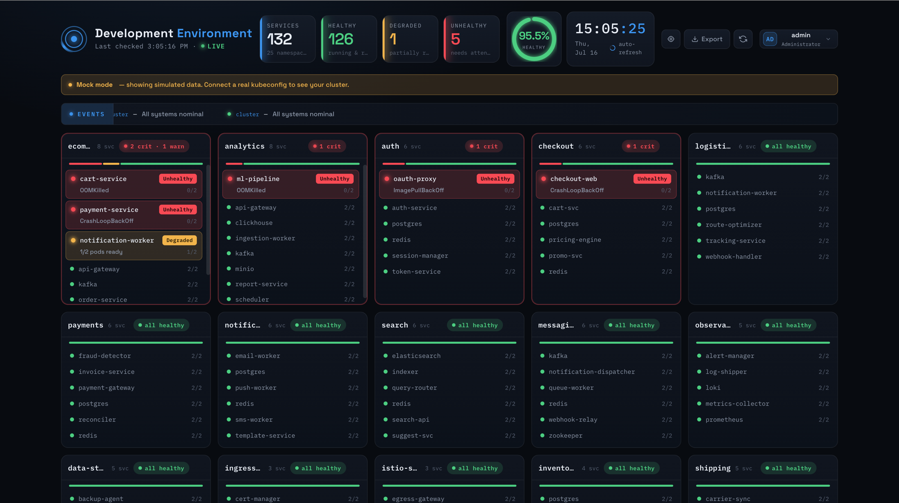
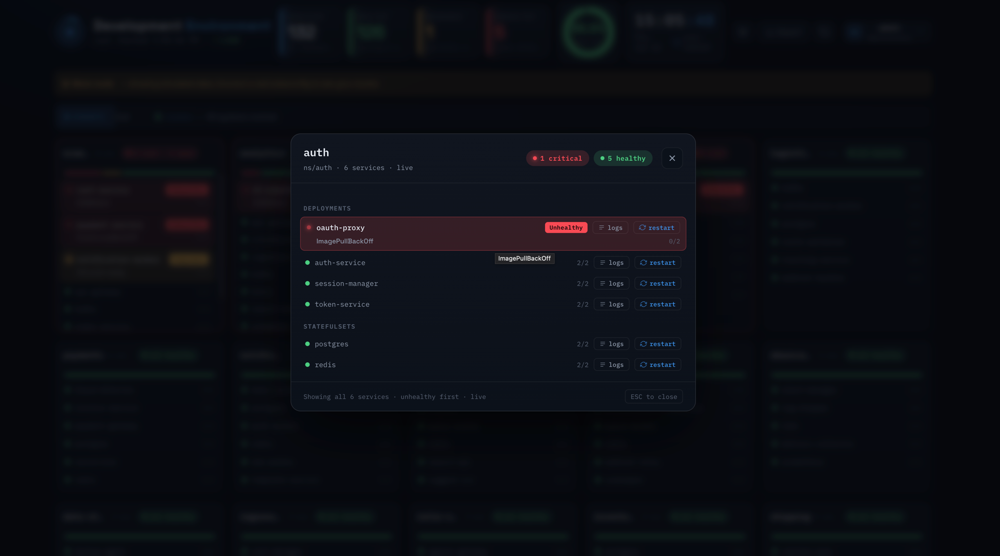
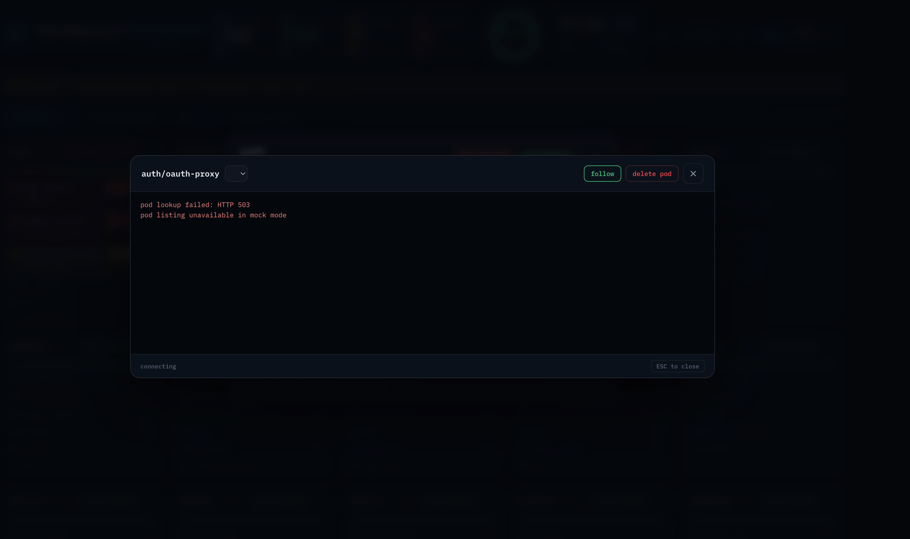
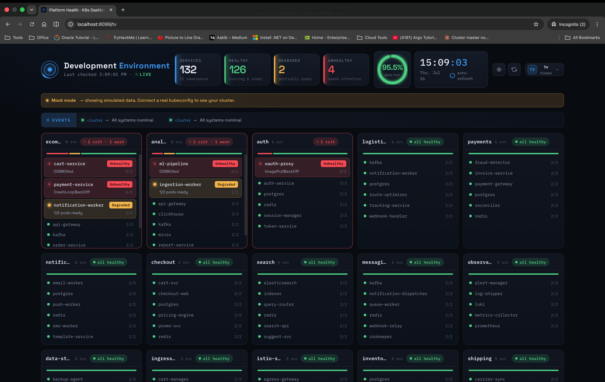
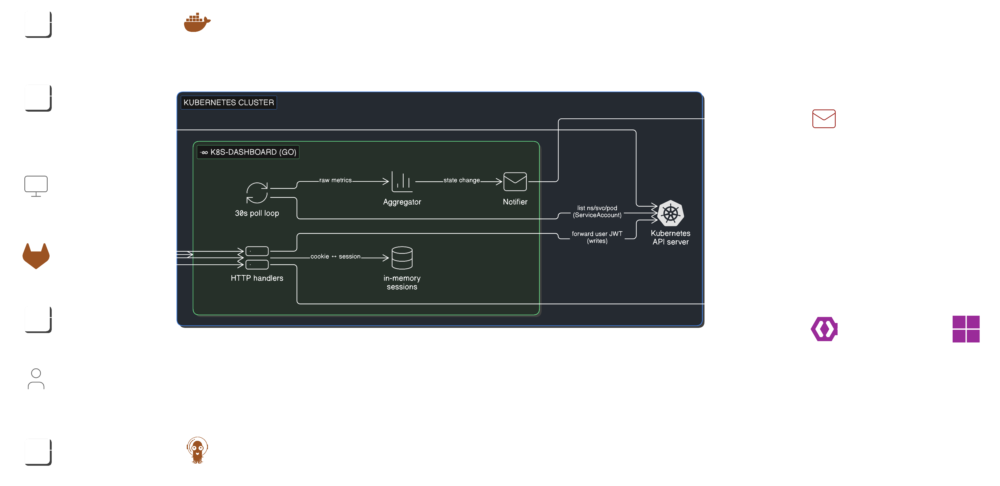
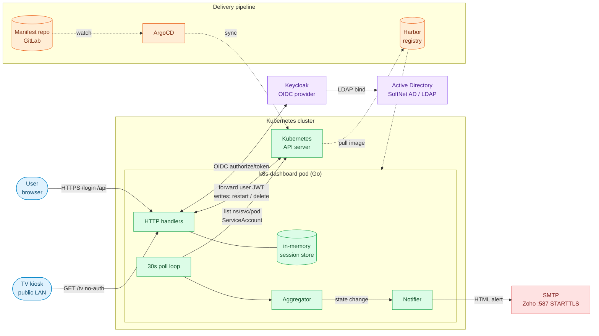

# k8s-dashboard

A read-only **product-level health dashboard** for Kubernetes with per-user RBAC, OIDC SSO, live log streaming, workload restart/delete actions, TV kiosk mode, and HTML email alerts.

Written in Go, single binary, no build step for the frontend, runs in-cluster or from a laptop against any reachable kubeconfig.



<details>
<summary>More screenshots</summary>

**Namespace drill-down** — click any product tile to see its Deployments and StatefulSets with per-workload restart / log actions:



**Live log viewer** — streams pod logs directly through the browser (real cluster; in mock mode the API returns 503 by design):



**TV kiosk mode** at `/tv` — public read-only, no auth, no cookies. Meant for wall-mounted status displays on internal networks:



<!-- Additional screenshots to add later:

-->

</details>

## What it does

- **Groups services into products.** Config maps namespaces or label selectors to product names. The UI shows one tile per product with `<healthy>/<total>` and a red/amber/green state.
- **Enforces per-user Kubernetes RBAC.** Users log in via Keycloak (SoftNet AD or any OIDC provider). The dashboard forwards the user's OIDC token to the API server for every read and every write — the apiserver decides, not the dashboard. Cluster admins see everything; namespace editors see only their namespace.
- **Streams pod logs live** through the browser using `kubectl logs -f`-style tailing.
- **Restart Deployments/StatefulSets** and **delete Pods** with the same RBAC-enforced token forwarding. UI hides the buttons for users without permission.
- **Broadcasts on a TV** in kiosk mode — a `/tv` endpoint serves a public read-only view with no auth or cookies, safe for iframes on internal networks.
- **Emails on state changes.** Configurable HTML alerts fire when a product transitions Healthy → Degraded → Critical. Plain-text fallback included.

## Architecture



<details>
<summary>Mermaid version (edit in place, renders on GitHub without image download)</summary>



</details>

**Flow legend:**
- **Read path**: browser → `/api/summary` → cached poll result. No apiserver hit per request.
- **Write path**: browser → `/api/workloads/.../restart` → app builds a K8s client **using the user's OIDC JWT** → apiserver validates + enforces RBAC → 200 or 403.
- **Alert path**: poll → aggregator detects transition → notifier sends HTML email.
- **Delivery path** (dashed): ArgoCD watches manifest repo, syncs to apiserver, apiserver pulls image from Harbor.

Full details in `docs/ARCHITECTURE.md` and `docs/PRODUCTION_READINESS.md`.

## Features (checked = live in the current release)

- [x] Product-level health aggregation (healthy/degraded/critical thresholds)
- [x] Namespace / service / pod drill-down
- [x] OIDC SSO with configurable admin group
- [x] Per-user Kubernetes RBAC via token forwarding
- [x] Live pod log streaming (`GET /api/pods/{ns}/{name}/logs`)
- [x] Workload rolling restart — Deployment or StatefulSet (`POST /api/workloads/{ns}/{kind}/{name}/restart`)
- [x] Pod delete (`DELETE /api/pods/{ns}/{name}`)
- [x] TV kiosk mode at `/tv` — public read-only
- [x] Static-token `/embed` for iframe auto-login
- [x] Email alerts on health state changes, HTML or plain text
- [x] Sender display name (`from_display_name`) + configurable "View dashboard" link
- [x] Prometheus `/metrics` endpoint
- [x] Mock mode for demos without a cluster
- [x] Configurable via YAML + env-var overrides
- [ ] Search bar across all products / namespaces (roadmap)
- [ ] Log viewer owner-ref lookup (currently label-based; misses non-standard labels — roadmap)
- [ ] Full OIDC logout — end Keycloak SSO session on click, not just local (roadmap)
- [ ] Android / Flutter mobile app (roadmap)
- [ ] SealedSecrets integration example (roadmap)
- [ ] Multi-cluster support (roadmap)

## Quick start

### 1. Zero-config demo (no cluster required)

```bash
docker run -p 8080:8080 -e MOCK_MODE=true \
  ghcr.io/<you>/k8s-dashboard:latest
```

Open [http://localhost:8080](http://localhost:8080). Uses fake data; shows a yellow "Mock mode" banner.

### 2. Standalone against a real cluster (from your laptop)

```bash
docker run -p 8080:8080 \
  -v ~/.kube/config:/kube/config:ro \
  -e KUBECONFIG=/kube/config \
  -e MOCK_MODE=false \
  ghcr.io/<you>/k8s-dashboard:latest
```

The container reads your kubeconfig and talks to the apiserver over the network. Useful for:
- Edge / air-gapped operations rooms
- Dev laptops watching a remote dev cluster
- Multi-cluster ops (run one instance per kubeconfig context)

### 3. In-cluster deployment (production)

Reference manifests in `k8s/`:

```bash
kubectl apply -f k8s/00-namespace.yaml
kubectl apply -f k8s/05-serviceaccount.yaml
kubectl apply -f k8s/06-clusterrole.yaml
kubectl apply -f k8s/07-clusterrolebinding.yaml
kubectl apply -f k8s/01-configmap.yaml

# Create the Secret separately — never commit the real one
# See k8s.example.secret.yaml for the full key list
kubectl -n k8s-dashboard create secret generic dashboard-secrets \
  --from-literal=DASHBOARD_SECRET="$(openssl rand -hex 32)" \
  --from-literal=ADMIN_USER="admin" \
  --from-literal=ADMIN_PASS="<strong>" \
  --from-literal=VIEWER_USER="viewer" \
  --from-literal=VIEWER_PASS="<strong>" \
  --from-literal=SMTP_PASSWORD="<smtp app password>" \
  --from-literal=EMBED_TOKEN="$(openssl rand -hex 24)" \
  --from-literal=OIDC_CLIENT_SECRET="<from Keycloak>"

kubectl apply -f k8s/02-deployment.yaml
kubectl apply -f k8s/03-service.yaml
kubectl apply -f k8s/04-httproute.yaml   # Gateway API — swap for Ingress if you prefer
```

For GitOps with ArgoCD, see the `argocd/` folder in the companion manifest repo.

## Configuration

Two layers: `config.yaml` (declarative, in ConfigMap or on disk) and env-var overrides (for secrets and per-env values).

### `config.yaml` highlights

```yaml
server:
  port: 8080
  poll_interval: 30s

excluded_namespaces:
  - kube-system
  - kube-public

thresholds:
  healthy: 100     # % services healthy
  degraded: 70

notifications:
  email:
    enabled: true
    smtp_host: "smtp.zoho.com"
    smtp_port: 587                          # STARTTLS — Go stdlib does not support implicit-TLS 465
    smtp_username: "notifier@example.com"
    from: "notifier@example.com"
    from_display_name: "K8s Dashboard"     # optional; renders as "K8s Dashboard <notifier@...>"
    to:
      - "team@example.com"
    on_state_change_only: true
    dashboard_url: "https://k8s-dashboard.example.com"
    html_body: true                         # false = plain text

oidc:
  enabled: true
  issuer_url: "https://keycloak.example.com/realms/YourRealm"
  client_id: "k8s-dashboard"
  admin_group: "k8s-cluster-admins"
  tls_skip_verify: false                    # true only for internal CAs
```

### Env-var overrides (from Secret)

| Var | Purpose |
|---|---|
| `DASHBOARD_SECRET` | Signs/verifies session cookies. Generate with `openssl rand -hex 32`. |
| `ADMIN_USER` / `ADMIN_PASS` | Local admin credentials — fallback when OIDC is down. |
| `VIEWER_USER` / `VIEWER_PASS` | Local read-only credentials. |
| `SMTP_PASSWORD` | Overrides `smtp_password` in `config.yaml`. |
| `EMBED_TOKEN` | Enables `/embed?token=...` iframe auto-login. |
| `OIDC_CLIENT_SECRET` | Keycloak client secret — required if OIDC enabled. |
| `OIDC_REDIRECT_URL` | Per-env override for the OIDC callback URL. |
| `APP_ENV` | Rendered in the HTML header ("Development" / "Production"). |
| `MOCK_MODE` | `true` → in-memory fake data, no cluster access needed. |

## OIDC + Kubernetes RBAC — how write actions get authorized

1. User logs in through Keycloak → dashboard stores the access token in the server-side session (never sent to the browser).
2. On any write action, the dashboard builds a K8s client **using that user's token**, not the pod's ServiceAccount.
3. The apiserver validates the JWT (via the cluster's `--oidc-issuer-url` / `--oidc-client-id` flags) and checks the user's group has the required verb.
4. Response is 200 if allowed, 403 if not — the dashboard just relays.

This means the dashboard cannot escalate — a user is only an admin in the cluster if the RBAC bindings say so. See `docs/ARCHITECTURE.md` for the full flow.

## Development

Prerequisites: Go 1.26+.

```bash
git clone https://github.com/<you>/k8s-dashboard.git
cd k8s-dashboard
go build ./cmd/server

# Mock mode — no cluster needed
MOCK_MODE=true ./server -config config/config.yaml

# Real cluster
KUBECONFIG=~/.kube/config ./server -config config/config.yaml
```

Frontend is vanilla HTML/CSS/JS in `web/` — no build step. Edit `web/index.html`, refresh browser.

Tests: `go test ./...` (currently limited coverage — contributions welcome).

## Roadmap

Priority-ordered:

1. **Log viewer owner-ref fix** — currently label-based; misses workloads with non-standard labels
2. **Search bar** at the top for filtering products/namespaces
3. **Full OIDC logout** — call Keycloak's `end_session_endpoint` instead of just clearing the local cookie
4. **SealedSecrets or ExternalSecrets example** — get `dashboard-secrets` into git safely
5. **Prometheus metrics dashboard integration** — inline Grafana panels next to each product tile
6. **Mobile app** — Flutter client that consumes the existing REST API; OIDC PKCE flow for auth
7. **Multi-cluster support** — one dashboard, kubeconfig context switcher

## Contributing

PRs welcome. For anything non-trivial, open an issue first to discuss the shape.

Preferred style:
- Small, focused commits
- Meaningful commit messages (see git log for examples)
- Format Go code with `gofmt -s` before pushing
- If your change touches auth, RBAC, or SMTP — include a rationale in the PR description

## License

MIT — see [LICENSE](LICENSE).

## Author

Labiyb M. Said — DevSecOps Engineer.
