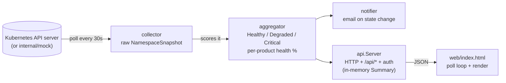
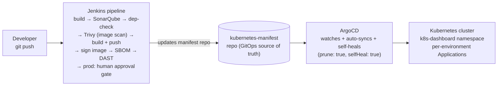

# Architecture, Technology & Operations Guide

A single, comprehensive reference for this project: what it is, what it's
built with, how it's structured, how data flows through it, how to run it
(locally and in a cluster), and where it actually runs in this org's CI/CD
pipeline. Read this before diving into the source.

For an actionable, ordered checklist of hardening work (secrets, TLS, audit
logging, RBAC review, etc.), see [`PRODUCTION_READINESS.md`](PRODUCTION_READINESS.md)
— that's a living plan/punch-list, kept separate from this reference doc.

---

## 1. What this is

A lightweight Go dashboard that polls your Kubernetes namespaces and shows a
per-product health score — green/amber/red — with email alerts on state
changes:

```
Product: ecommerce    ██████████ 12/12  ● Healthy
Product: analytics    █████░░░░░  7/12  ● Critical  → email sent
Product: auth         ████████░░  8/10  ● Degraded
```

It needs **no database** — every poll cycle re-derives the full picture from
the Kubernetes API (or from `internal/mock` if no cluster is reachable), so
any number of replicas can answer any request identically. That statelessness
is the single most important architectural property of this codebase; nearly
every other design choice (in-memory `Summary`, signed-cookie sessions,
horizontal scalability) follows from it.

---

## 2. Technology stack

| Layer | Technology | Notes |
|---|---|---|
| Language / runtime | **Go 1.22** | single static binary, no runtime deps |
| Kubernetes client | **client-go** (`k8s.io/client-go`) | `rest.InClusterConfig()` → falls back to `~/.kube/config`; `.List()`-only access pattern (see §6 RBAC) |
| HTTP server | Go standard library `net/http` + `http.ServeMux` | no web framework |
| Logging | `log/slog` (structured JSON) | see `cmd/server/main.go` for the handler setup |
| Auth / sessions | Hand-rolled HMAC-SHA256 signed cookies | no JWT library, no OAuth/OIDC today — see §7 |
| Email | Go standard library `net/smtp` | templated plaintext email, see `internal/notifier` |
| Frontend | Static HTML + CSS + **vanilla JS** | no build step, no framework, no bundler — `http.ServeFile` straight from disk |
| Config | Plain YAML (`gopkg.in/yaml.v3`) | `config/config.yaml`, loaded once at startup (not hot-reloaded) |
| Container | **Docker** (multi-stage build) | see `Dockerfile` / `docker-compose.yml` |
| CI | **Jenkins** (shared library pipeline) | build → SonarQube → dependency-check → Trivy → sign → SBOM → DAST |
| CD | **ArgoCD** (GitOps, separate manifest repo) | auto-sync + self-heal per environment |
| Orchestration | **Kubernetes** | `Deployment` + `Service` + RBAC (`ServiceAccount`/`ClusterRole`/`ClusterRoleBinding`) + health probes |
| Observability | `/healthz`, `/readyz`, `/metrics` (Prometheus exposition format) | see `internal/api/metrics.go` |

---

## 3. The big picture — request & data flow

```
┌─────────────┐   poll every 30s    ┌──────────────┐    scores it    ┌─────────────┐
│  Kubernetes  │ ───────────────────▶│  collector   │ ───────────────▶│ aggregator  │
│  API server  │   (or mock data)    │ (raw status) │  (Healthy/      │ (per-product│
└─────────────┘                      └──────────────┘   Degraded/     │  health %)  │
                                                          Critical)    └──────┬──────┘
                                                                              │
                                            ┌─────────────────────────────────┤
                                            │                                 │
                                            ▼                                 ▼
                                     ┌─────────────┐                  ┌──────────────┐
                                     │  notifier   │                  │  api.Server  │
                                     │ (email on   │                  │ (HTTP +      │
                                     │  state      │                  │  /api/*      │
                                     │  change)    │                  │  + auth)     │
                                     └─────────────┘                  └──────┬───────┘
                                                                              │ JSON
                                                                              ▼
                                                                    ┌──────────────────┐
                                                                    │  web/index.html  │
                                                                    │  (poll + render) │
                                                                    └──────────────────┘
```

The same flow as a Mermaid diagram (renders directly on GitHub, and can be
pasted straight into eraser.io — see §10 for more on that):



Everything is **in-memory and stateless** — there is no database. This is
what makes the app trivial to scale horizontally: spin up N replicas behind
a `Service`, and each one independently polls, scores, and serves identical
answers (as long as they share `DASHBOARD_SECRET` — see §7.1).

---

## 4. Component-by-component

### `cmd/server/main.go` — entrypoint
Parses flags (`-config`, `-mock`), loads `config/config.yaml`, builds the
`api.Server`, and starts it. About 40 lines — start here to see the boot
sequence in order.

### `config/` — configuration loading
Defines the `Config` struct and `Load(path)`, which reads `config.yaml`
(server port, poll interval, excluded namespaces, health thresholds, SMTP
settings). Plain YAML, no env-var overrides today (see
[`PRODUCTION_READINESS.md`](PRODUCTION_READINESS.md) §1.3 for why that
matters for the SMTP password specifically).

### `internal/collector` — talks to Kubernetes
`Collector.CollectAll()` returns a `[]NamespaceSnapshot`, where each snapshot
is one namespace's raw workload state: every Deployment/StatefulSet's
`Status` (`Healthy`/`Degraded`/`Unhealthy`), `Reason` (e.g.
`CrashLoopBackOff`), and `Ready`/`Desired` replica counts.

- `New()` auto-detects environment: tries in-cluster config first (when
  running as a pod, using the ServiceAccount token), falls back to
  `~/.kube/config` (when running on a laptop). Same binary, no flags needed.
- It deliberately raises the client-go rate limiter above the 5 req/s default
  — see the comment block in `collector.go` explaining the
  `context deadline exceeded` issue this fixes when polling 20+ namespaces in
  parallel.
- It only ever calls `.List()` — never `.Get()`/`.Watch()`/`Events()`/
  `GetLogs()` — which is why the ClusterRole (`k8s/k8s/06-clusterrole.yaml`)
  is scoped to the `list` verb only (least privilege; see §6 and
  [`PRODUCTION_READINESS.md`](PRODUCTION_READINESS.md) §3.3). It watches
  **Deployments and StatefulSets** only — not DaemonSets, Jobs, or CronJobs;
  that's a deliberate scope choice (the dashboard models "is my service/stateful
  infra healthy", not node-level infrastructure).

### `internal/mock` — fake data generator
A drop-in replacement for `Collector` with the exact same `CollectAll()`
shape, used when `-mock` is passed or no cluster is reachable. Useful for UI
work and demos without touching a real cluster. It defines:
- `products` — the list of fake namespaces and their services (currently 20)
- `staticIssues` — services that are *permanently* broken in specific
  namespaces, so the dashboard always has something interesting to show
- `flappingPool` — services that randomly break/recover each poll (~15%
  chance), to simulate real-world churn and exercise the alert-ticker /
  re-sort behavior

### `internal/aggregator` — turns raw status into a health score
Takes the raw `[]NamespaceSnapshot` and produces a `Summary`: for each
namespace, it computes `ScorePercent` (= healthy services ÷ total services)
and maps that to a `HealthLevel` (`Healthy`/`Degraded`/`Critical`) using the
thresholds from `config.yaml` (`thresholds.healthy` / `thresholds.degraded`).
It also tracks `previousStates` per namespace so the notifier can detect
*transitions* (green→amber, amber→red) rather than firing on every poll.

This is the file to edit if you want to change how a "Healthy" vs "Degraded"
vs "Critical" score is calculated (`scoreToHealth()`).

### `internal/notifier` — email alerts
Sends an email (via SMTP, configured in `config.yaml`) when a product's
`HealthLevel` changes, gated by `on_state_change_only` so it doesn't spam on
every 30-second poll. Template lives in `notifier.go` (`emailTemplate`).

### `internal/auth` — login, sessions, roles
Self-contained credential store + signed-cookie session system. See §7
below — this is dense enough to deserve its own section.

### `internal/api` — HTTP server, routing, poll loop
`Server.Start()`:
1. Runs one poll immediately, then launches `pollLoop()` as a background
   goroutine (re-polls every `poll_interval`).
2. Registers all HTTP routes on a `http.ServeMux` (see the table in §5).
3. Wraps the whole mux in `auth.Middleware` and starts `http.ListenAndServe`.

`poll()` calls the collector (real or mock), feeds the result to the
aggregator, stores the resulting `Summary` for `/api/summary` to serve, and
hands state-change events to the notifier.

### `web/index.html` + `web/login.html` — the frontend
Static HTML/CSS/vanilla-JS, no build step, no framework. Served via
`http.ServeFile` directly from disk on every request — **edit the `.html`
files and refresh the browser; no rebuild or restart needed** (this is *not*
true for `.go` files, which are compiled — see §8).

`index.html`'s JS polls `/api/summary` every `poll_interval`, diffs the new
snapshot against the last one to derive alert-ticker entries client-side
(no server-side event log exists), and re-renders the namespace grid sorted
"issues first" (`rankHealth`). The drill-down modal and export menu are
gated to `currentRole === 'admin'` (set from `/api/me`).

---

## 5. HTTP routes

All routes are registered in `internal/api/server.go:Start()`:

| Route | Handler | Auth |
|---|---|---|
| `GET/POST /login` | `auth.HandleLogin` | public (passes through `auth.Middleware`) |
| `GET /logout` | `auth.HandleLogout` | public |
| `GET /api/summary` | `handleSummary` | any authenticated session |
| `GET /api/mode` | `handleMode` | **public** — the login page's "DATA SOURCE" panel needs it pre-auth |
| `GET /api/me` | `handleMe` | any authenticated session |
| `GET /api/export` | `handleExport` | **admin only** — wrapped in `auth.RequireAdmin` |
| `GET /healthz` | `handleHealthz` | public — kubelet liveness probe |
| `GET /readyz` | `handleReadyz` | public — kubelet readiness probe |
| `GET /metrics` | `handleMetrics` | public — Prometheus scrape target |
| `GET /favicon.svg` | inline handler | public |
| `GET /*` (everything else) | `handleIndex` | any authenticated session |

`auth.Middleware` redirects unauthenticated requests to `/login`, with an
explicit allow-list for the public routes above (`/login`, `/logout`,
`/healthz`, `/readyz`, `/metrics`, `/api/mode` — none of which expose cluster
data; `/api/mode` is just `{"mock": bool}`, `/metrics` is operational counters
only). `/api/export` additionally requires the `admin` role server-side;
everything else that *looks* admin-only in the UI (the drill-down modal) is
gated client-side only — see §7.2 for why that's currently safe but worth
knowing.

---

## 6. RBAC — what the dashboard is allowed to do in your cluster

`k8s/k8s/06-clusterrole.yaml` defines a `ClusterRole` bound (via
`07-clusterrolebinding.yaml`) to a single `ServiceAccount`
(`k8s-dashboard`), scoped to **`list` only** on `namespaces`,
`deployments`/`statefulsets` (`apps`), and `pods`:

```yaml
rules:
  - apiGroups: [""]
    resources: ["namespaces"]
    verbs: ["list"]
  - apiGroups: ["apps"]
    resources: ["deployments", "statefulsets"]
    verbs: ["list"]
  - apiGroups: [""]
    resources: ["pods"]
    verbs: ["list"]
```

This was tightened from the broader `["get", "list", "watch"]` after
grep-verifying every call site in `collector.go` only ever calls `.List()`
(see [`PRODUCTION_READINESS.md`](PRODUCTION_READINESS.md) §3.3 for the
evidence trail). **If you add a feature that needs more** — e.g. streaming
pod logs, which would need `get` on the `pods/log` subresource — add that
verb *then*, deliberately, not speculatively now.

---

## 7. The auth model in detail

### 7.1 How a session works (no database, no JWT library)
This is a hand-rolled, stateless, signed-cookie scheme — not OAuth/OIDC, not a
standard JWT library, just HMAC-SHA256 over a custom payload:

1. **Login**: `HandleLogin` checks the submitted username/password against an
   in-memory `[]User` list (built at startup from `ADMIN_USER`/`ADMIN_PASS`/
   `VIEWER_USER`/`VIEWER_PASS` env vars, defaulting to `admin`/`admin` and
   `viewer`/`viewer` if unset — see the warnings this prints at boot). Login
   attempts are rate-limited per-IP (`auth.RateLimitLogin`) to blunt
   brute-force guessing.
2. **Token**: on success, `createToken(username, role)` builds
   `base64url(username + "\x00" + role + "\x00" + expiry)`, computes an
   HMAC-SHA256 signature over it using `DASHBOARD_SECRET`, and concatenates
   them as `payload.signature_hex`. This becomes the `k8s_session` cookie
   value (`HttpOnly`, `SameSite=Lax`, 24-hour expiry).
3. **Every subsequent request**: `auth.Middleware` calls `parseToken`, which
   re-computes the HMAC over the payload and compares it
   (constant-time, via `hmac.Equal`) against the signature in the cookie. If
   it matches and hasn't expired, the request proceeds with `*Claims{Username,
   Role}` injected into the request context — retrievable anywhere downstream
   via `auth.ClaimsFromContext(r.Context())`.

No session store, no database, no server-side state at all — any replica with
the same `DASHBOARD_SECRET` can validate any session's cookie. This is *why*
`DASHBOARD_SECRET` must be both **set** and **shared** across replicas (see
[`PRODUCTION_READINESS.md`](PRODUCTION_READINESS.md) §1.1) — without a
fixed shared secret, sessions break on restart and differ per-replica.

### 7.2 Admin vs. Viewer — what actually differs
Both roles see **identical data** — `/api/summary` returns the same JSON
regardless of role; nothing is filtered server-side by role. The only
differences are in *capability*:

| Capability | Viewer | Admin |
|---|---|---|
| View namespace health, stats, gauge, ticker | ✅ | ✅ |
| Open the drill-down modal (per-pod detail) | ❌ — hidden client-side (`currentRole !== 'admin'` early-return in `index.html`) | ✅ |
| Use the export menu (JSON/CSV download) | ❌ — hidden client-side **and** the server returns `403 forbidden: admin role required` (`auth.RequireAdmin` wraps `/api/export`) | ✅ |

In short: **`/api/export` is the only route enforced server-side**; the modal
is a client-side convenience gate. That's safe today because no data exposed
through the modal is more sensitive than what `/api/summary` already returns
to everyone — but it's a pattern to be deliberate about (see
[`PRODUCTION_READINESS.md`](PRODUCTION_READINESS.md) §2.2) if you ever
add an admin-only *write* action.

### 7.3 If you swap in Keycloak / OIDC later
The clean integration point is `HandleLogin` — replace its credential check
with an OIDC Authorization Code flow against Keycloak (using `go-oidc` +
`oauth2`), map the Keycloak realm role (e.g. `dashboard-admin`) to
`auth.RoleAdmin`/`auth.RoleViewer`, and call the *existing* `createToken` to
mint the same `k8s_session` cookie. Everything downstream — `Middleware`,
`RequireAdmin`, `/api/me`, the frontend role gating — stays untouched, because
the session/cookie layer is decoupled from how the identity was established.

---

## 8. Running it locally

This trips people up, so it's worth calling out explicitly first:

> - **`web/*.html`** are served via `http.ServeFile` reading straight from disk
>   on every request. Edit them, refresh your browser — done. No restart.
> - **`internal/**/*.go` and `cmd/**/*.go`** are compiled into the binary at
>   `go build`/`go run` time. Editing them has **no effect** on an
>   already-running server — you must stop the old process and re-run
>   `go run ./cmd/server ...` to pick up the change.

### Project structure
```
k8s-dashboard/
├── cmd/server/main.go          ← entrypoint
├── internal/
│   ├── collector/              ← talks to k8s API, fetches raw state
│   ├── mock/                   ← fake-data generator (mock mode)
│   ├── aggregator/             ← computes health scores
│   ├── notifier/               ← sends email alerts
│   ├── auth/                   ← login, sessions, roles, rate-limiting
│   └── api/                    ← HTTP server, routing, poll loop, /healthz /metrics
├── web/                        ← index.html (dashboard) + login.html (frontend, no build step)
├── config/config.yaml          ← your settings (port, thresholds, SMTP, excluded namespaces)
├── k8s/k8s/                    ← numbered manifests: Namespace, ConfigMap, Deployment,
│                                  Service, ServiceAccount, ClusterRole, ClusterRoleBinding
├── k8s/argocd/                 ← per-environment ArgoCD Application manifests
├── docker-compose.yml          ← local dev convenience (mock or `--profile real`)
└── Dockerfile                  ← multi-stage build for the production image
```

### Option A — Docker (no Go install needed)

Just want to see the UI with fake data?
```bash
docker compose up
```
Then open http://localhost:8080 — that's it. No Go, no k8s cluster needed.
A yellow "Mock mode" banner appears in the UI so you know it's fake data.

Want to point it at your real cluster?
```bash
docker compose --profile real up
```
This mounts your `~/.kube/config` into the container automatically.

### Option B — Run with Go directly (faster for development)

Prerequisites: **Go 1.22+**

```bash
# 1. Install dependencies
go mod tidy

# 2. Mock mode (no cluster needed):
go run ./cmd/server -mock -config config/config.yaml

# 3. Or real mode (auto-detects ~/.kube/config; falls back to mock if none found):
go run ./cmd/server -config config/config.yaml

# 4. Open browser
open http://localhost:8080
```

`-mock` forces fake data; omit it to auto-detect a real cluster. See §6 for
exactly what permissions the dashboard needs from that cluster.

### Tweaking things

| What to change | Where |
|---|---|
| Server port / poll interval | `config.yaml` → `server.port` / `server.poll_interval` |
| Health thresholds | `config.yaml` → `thresholds.healthy / degraded` |
| SMTP settings | `config.yaml` → `notifications.email` |
| Excluded namespaces | `config.yaml` → `excluded_namespaces` (see §9 below) |
| Health scoring logic | `internal/aggregator/aggregator.go` → `scoreToHealth()` |
| Email template | `internal/notifier/notifier.go` → `emailTemplate` |
| Dashboard UI | `web/index.html` / `web/login.html` |

---

## 9. Excluding namespaces from collection

Add the namespace name to `excluded_namespaces` in `config/config.yaml`:

```yaml
excluded_namespaces:
  - kube-system
  - kube-public
  - kube-node-lease
  - k8s-dashboard      # exclude our own namespace
  - my-namespace-here  # ← add yours here
```

Flow: `config/config.go` loads it as `cfg.ExcludedNS` → `internal/api/poll.go`
passes it to `collector.CollectAll(ctx, cfg.ExcludedNS)` → `collector.go`
builds an O(1) lookup set and skips any namespace whose name matches before
ever calling the K8s API for it. Takes effect on the **next restart** — config
is loaded once at boot, not hot-reloaded.

---

## 10. Where it runs — deployment & CI/CD

### 10.1 Manual path (for forks / first-time cluster deploys)

```bash
# 1. Build and push the image (replace with your registry)
docker build -t yourregistry/k8s-dashboard:latest .
docker push yourregistry/k8s-dashboard:latest

# 2. Point the Deployment at your image
#    edit k8s/k8s/02-deployment.yaml → spec.template.spec.containers[0].image

# 3. Create the Secret the Deployment expects (DASHBOARD_SECRET, ADMIN_*,
#    VIEWER_*, SMTP_PASSWORD) — see k8s/k8s/01-secret.example.yaml

# 4. Apply in order (numbered for a reason — RBAC before workload)
kubectl apply -f k8s/k8s/

# 5. Check it started
kubectl -n k8s-dashboard get pods
kubectl -n k8s-dashboard logs -f deploy/k8s-dashboard

# 6. Access it
kubectl -n k8s-dashboard port-forward svc/k8s-dashboard 8080:80
open http://localhost:8080
```

### 10.2 The actual pipeline used in this org (CI/CD → ArgoCD → K8s)

```
   git push                 Jenkins pipeline                  ArgoCD                K8s
 ──────────────▶  ┌──────────────────────────────┐   ┌──────────────────┐   ┌─────────────┐
                  │ build → SonarQube → dep-check │   │ watches the      │   │ k8s-dashboard│
                  │ → Trivy (image) → build+push  │──▶│ manifest repo,   │──▶│ namespace,   │
                  │ → sign image → SBOM → DAST    │   │ auto-syncs +     │   │ per-env      │
                  │ → (prod: human approval gate) │   │ self-heals       │   │ Applications │
                  └──────────────────────────────┘   └──────────────────┘   └─────────────┘
```



- **`Jenkinsfile`** (repo root) — the full pipeline: builds the Go binary,
  runs SonarQube + dependency-check + Docker image vulnerability scanning
  (`vulnScanDocker` / `vulnScanApplicationImage` — Trivy under the hood),
  builds/signs/pushes the image (tagged with the build number on
  dev/staging/UAT, and with the `RELEASE_VERSION`/`VERSION` file contents on
  the `prod` branch), generates an SBOM, runs DAST, and — only on the `prod`
  branch — gates the release behind a **human approval stage** before
  updating the deployment manifest.
- **`k8s/argocd/*.yaml`** — one ArgoCD `Application` per environment (`dev`,
  `staging`, `uat`, `prod`), each pointing at a different branch of a separate
  manifest repo (`kubernetes-manifest/k8s-dashboard-manifest.git`) and
  namespace. ArgoCD watches that repo and auto-syncs (`prune: true, selfHeal:
  true`) — Jenkins's job ends at "update the manifest repo"; ArgoCD takes it
  from there into the cluster. The `prod` Application also wires up email
  notifications on sync success/failure, health-status changes, and
  crash-loop detection.
- **`k8s/k8s/*.yaml`** — the actual Kubernetes manifests (Namespace,
  ConfigMap, Secret example, ServiceAccount, ClusterRole, ClusterRoleBinding,
  Deployment with `/healthz`/`/readyz` probes and resource limits, Service)
  that ArgoCD applies. Numbered to show apply order.
- **`docker-compose.yml`** / **`Dockerfile`** — local/dev convenience path
  (`docker compose up` for mock mode, `--profile real` to mount your
  kubeconfig) — not used in the CI/CD path above, which builds its own image.

For the gaps in this pipeline worth tracking (image scanning thresholds, RBAC
review, session revocation, etc.), see
[`PRODUCTION_READINESS.md`](PRODUCTION_READINESS.md).

### 10.3 Security tip — store the SMTP password in a Secret, not the ConfigMap

```bash
kubectl -n k8s-dashboard create secret generic smtp-credentials \
  --from-literal=password=your-actual-app-password
```
Then mount it as `SMTP_PASSWORD` (the Deployment already reads this env var
and `config.go` overrides `config.yaml`'s `smtp_password` with it — see
`k8s/k8s/01-secret.example.yaml` and `k8s/k8s/02-deployment.yaml`).

---

## 11. Diagrams for external tools (e.g. eraser.io)

The Mermaid blocks in §3 and §10.2 above are **directly pasteable into
eraser.io** — its editor has a "Mermaid import" that converts Mermaid syntax
into an editable Eraser diagram (Insert → Import → Mermaid, or paste into a
new diagram and choose "Convert from Mermaid"). That's the most robust route
since Mermaid is a stable, well-documented standard and these blocks also
render natively in GitHub.

If you'd rather author directly in Eraser's own diagram-as-code DSL (cloud
architecture style, with icons), here's an equivalent starting point — paste
this into a new Eraser diagram and adjust icons/grouping to taste:

```
title K8s Platform Health Dashboard — Runtime Architecture

Kubernetes API [icon: kubernetes]
Collector [icon: server, label: "collector\n(raw status, .List() only)"]
Aggregator [icon: bar-chart-2, label: "aggregator\n(health scoring)"]
Notifier [icon: mail, label: "notifier\n(SMTP alerts)"]
API Server [icon: globe, label: "api.Server\n(HTTP + auth + /metrics)"]
Frontend [icon: monitor, label: "web/index.html\n(poll + render)"]
Browser [icon: user, label: "Admin / Viewer"]

Kubernetes API > Collector: poll every 30s
Collector > Aggregator: []NamespaceSnapshot
Aggregator > Notifier: state-change events
Aggregator > API Server: in-memory Summary
API Server > Frontend: JSON (/api/summary)
Browser > API Server: HTTPS + signed session cookie
Frontend > Browser: rendered dashboard
```

And for the deployment topology (§10.2):

```
title K8s Platform Health Dashboard — CI/CD & Deployment

Developer [icon: user]
Jenkins [icon: jenkins, label: "Jenkins pipeline\nbuild, scan, sign, SBOM, DAST"]
Manifest Repo [icon: git-branch, label: "kubernetes-manifest repo\n(GitOps source of truth)"]
ArgoCD [icon: argo, label: "ArgoCD\nauto-sync + self-heal"]
K8s Cluster [icon: kubernetes, label: "k8s-dashboard namespace\n(per-env Applications)"]

Developer > Jenkins: git push
Jenkins > Manifest Repo: update image tag / manifest
Manifest Repo > ArgoCD: watched (polling/webhook)
ArgoCD > K8s Cluster: sync + apply
```

(Eraser's exact icon-name catalogue changes over time — if a given `icon:`
value isn't recognized, Eraser will just render the node without an icon;
swap in whatever's available in your account's icon picker.)

---

## 12. Future: Keycloak / SSO and SMTP — integration notes

- **Keycloak / OIDC**: see §7.3 above for the integration point
  (`HandleLogin`). The role-mapping and session-cookie layers need no change.
- **SMTP**: `internal/notifier` and `config.yaml`'s `notifications.email`
  block are already wired up and templated — switching from placeholder to
  real credentials is a config-only change (plus the Secret approach in
  §10.3 for production). See [`PRODUCTION_READINESS.md`](PRODUCTION_READINESS.md)
  §1.3 for why the password specifically shouldn't live in plain `config.yaml`.
